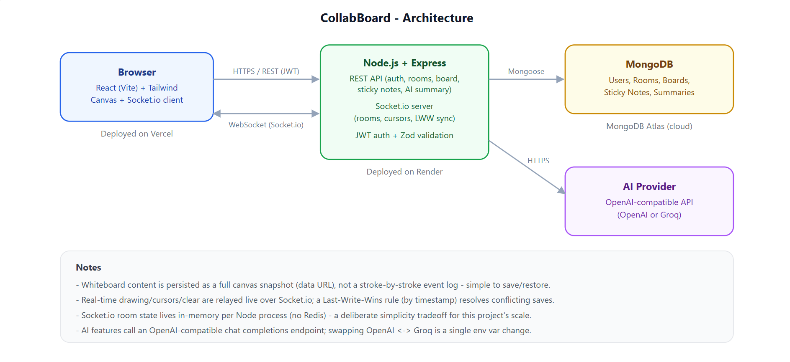

# CollabBoard

**AI-Assisted Real-Time Collaborative Whiteboard**


## Demo

Frontend: https://collab-board-eosin.vercel.app

Backend: https://collabboard-86sn.onrender.com


CollabBoard is a full-stack, production-style web app that lets teams create rooms and draw together on a shared whiteboard in real time - plus a couple of genuinely useful AI features (auto-generated sticky notes and structured meeting summaries) layered on top.

---

## Table of Contents
- [Project Overview](#project-overview)
- [Architecture](#architecture)
- [Features](#features)
- [Tech Stack](#tech-stack)
- [Project Structure](#project-structure)
- [API Reference](#api-reference)
- [License](#license)

---

## Project Overview

A user registers, creates or joins a room via a short shareable code, and draws on a canvas with a collaborator in real time - cursors, strokes, and clears all sync live over WebSockets. The board auto-saves to MongoDB every 10 seconds (and on demand via a Save button), keeps a short restoreable history, and reloads exactly where it left off the next time the room is opened. On top of that, a lightweight AI panel can turn a one-line prompt like *"Generate sprint tasks for login module"* into draggable sticky notes, or turn a room's sticky notes into a structured meeting recap (summary, action items, decisions, open questions).

---

## Architecture



**Request flow:** the React SPA talks to Express over two channels - REST for everything CRUD-shaped (auth, rooms, board saves, sticky notes, AI) and a single persistent Socket.io connection for anything that needs to feel instant (live strokes, cursor positions, participant counts). Both are authenticated with the same JWT. Express talks to MongoDB via Mongoose for all persistence, and to an OpenAI-compatible chat completions endpoint (OpenAI or Groq, swappable via one env var) for the two AI features.

---

## Features

**Auth**
- Register / login with JWT, bcrypt-hashed passwords, protected routes
- Session persists across refresh; expired/invalid tokens are handled centrally (auto-logout + toast)

**Rooms**
- Create a room (gets a random 6-character shareable code) or join one by code
- Rename / delete a room (owner-only, enforced server-side)
- Dashboard lists your rooms, most recently updated first, with a skeleton loading state

**Whiteboard**
- Pen + eraser tools, adjustable brush size, color picker, clear board
- Undo/redo (local, snapshot-based)
- Auto-saves every 10 seconds (only if something changed) + manual Save button
- Short version history with one-click restore
- Board reloads automatically when a room is reopened

**Real-time collaboration**
- Every room is a Socket.io room; strokes, clears, and cursor positions broadcast live
- Live participant count + connection status indicator
- Automatic reconnect handling - a dropped connection re-syncs against the server's canonical state with no special-case code
- Last-Write-Wins conflict resolution for the persisted board state

**AI**
- **Sticky Notes**: type a prompt, get back a handful of draggable sticky notes on the board
- **Meeting Summary**: turns a room's sticky notes into a structured recap (Summary / Action Items / Decisions Taken / Open Questions), shown in a side panel and stored in MongoDB
- Works with either OpenAI or Groq - same code, one env var (`OPENAI_BASE_URL`) to switch

**Production polish**
- Toast notifications for key actions (save, generate, rename, delete, session expiry, network errors)
- Centralized error handling on both ends: a single Express error-handling middleware (with production-safe message sanitization for unexpected errors) and a single axios response interceptor on the frontend
- Zod-validated request bodies + explicit ObjectId route-param validation
- Responsive layout, including a full-screen AI panel overlay on mobile instead of a squeezed sidebar
- Dockerized (with a health check), `docker compose up` runs the whole stack locally

---

## Tech Stack

**Frontend:** React 18 (Vite), Tailwind CSS, React Router, Axios, Socket.io Client, react-hot-toast

**Backend:** Node.js, Express, MongoDB + Mongoose, Socket.io, JWT, bcryptjs, Zod, OpenAI SDK

**Infra:** Docker + Docker Compose, MongoDB Atlas, Vercel (frontend), Render (backend)

---

## Project Structure

```
collabboard/
├── backend/
│   └── src/
│       ├── config/          # DB connection
│       ├── controllers/     # Route handlers (auth, rooms, board, sticky notes, AI)
│       ├── middleware/      # auth, validation, ObjectId checks, centralized error handler
│       ├── models/          # Mongoose schemas (User, Room, Board, StickyNote, MeetingSummary)
│       ├── routes/          # Express routers
│       ├── services/        # aiService.js - the OpenAI-compatible AI wrapper
│       ├── socket/          # Socket.io wiring, in-memory room state, LWW logic
│       ├── utils/           # ApiError, asyncHandler, JWT helper, room code generator
│       └── validators/      # Zod schemas
│
├── frontend/
│   └── src/
│       ├── api/              # Axios calls, one file per resource
│       ├── components/       # Reusable UI (dialogs, PageLoader, Skeleton, Navbar...)
│       │   └── whiteboard/   # Toolbar, Whiteboard canvas, StickyNoteItem, AiPanel...
│       ├── constants/        # Shared constants (canvas size, storage keys)
│       ├── context/          # AuthContext
│       ├── hooks/            # useRoomSocket, useBoardPersistence, useStickyNotes...
│       ├── pages/             # Login, Register, Dashboard, Room, NotFound
│       ├── routes/           # ProtectedRoute
│       └── socket/           # Shared Socket.io client instance
│
├── docs/
│   └── architecture.svg
├── docker-compose.yml
├── .env.example               # for docker compose
└── README.md
```

---

## API Reference

All routes are prefixed with `/api`. Protected routes require `Authorization: Bearer <token>`.

| Method | Endpoint | Auth | Description |
|---|---|:---:|---|
| GET | `/health` | — | Service + DB health check |
| POST | `/auth/register` | — | Register |
| POST | `/auth/login` | — | Login |
| GET | `/auth/me` | Yes | Current user |
| POST | `/rooms` | Yes | Create room |
| POST | `/rooms/join` | Yes | Join room by code |
| GET | `/rooms` | Yes | List my rooms |
| GET | `/rooms/:id` | Yes | Room details |
| PATCH | `/rooms/:id` | Owner | Rename room |
| DELETE | `/rooms/:id` | Owner | Delete room (cascades) |
| GET | `/rooms/:id/board` | Yes | Load persisted board + history |
| POST | `/rooms/:id/board` | Yes | Save board (auto-save & manual save) |
| GET | `/rooms/:id/sticky-notes` | Yes | List sticky notes |
| POST | `/rooms/:id/sticky-notes/generate` | Yes | AI-generate sticky notes from a prompt |
| PATCH | `/rooms/:id/sticky-notes/:noteId` | Yes | Update note position |
| DELETE | `/rooms/:id/sticky-notes/:noteId` | Yes | Delete a note |
| GET | `/rooms/:id/ai/summary` | Yes | Latest meeting summary |
| POST | `/rooms/:id/ai/summary` | Yes | Generate a new summary from sticky notes |

**Socket.io events** (see `backend/src/socket/index.js` for the full contract): `join-room`, `draw`, `clear-board`, `canvas-sync`, `cursor-move`, `leave-room` (client to server); `board-state`, `participants-update`, `draw`, `clear-board`, `canvas-sync`, `cursor-move`, `cursor-leave` (server to clients).

---

## License

MIT - see [LICENSE](LICENSE).
